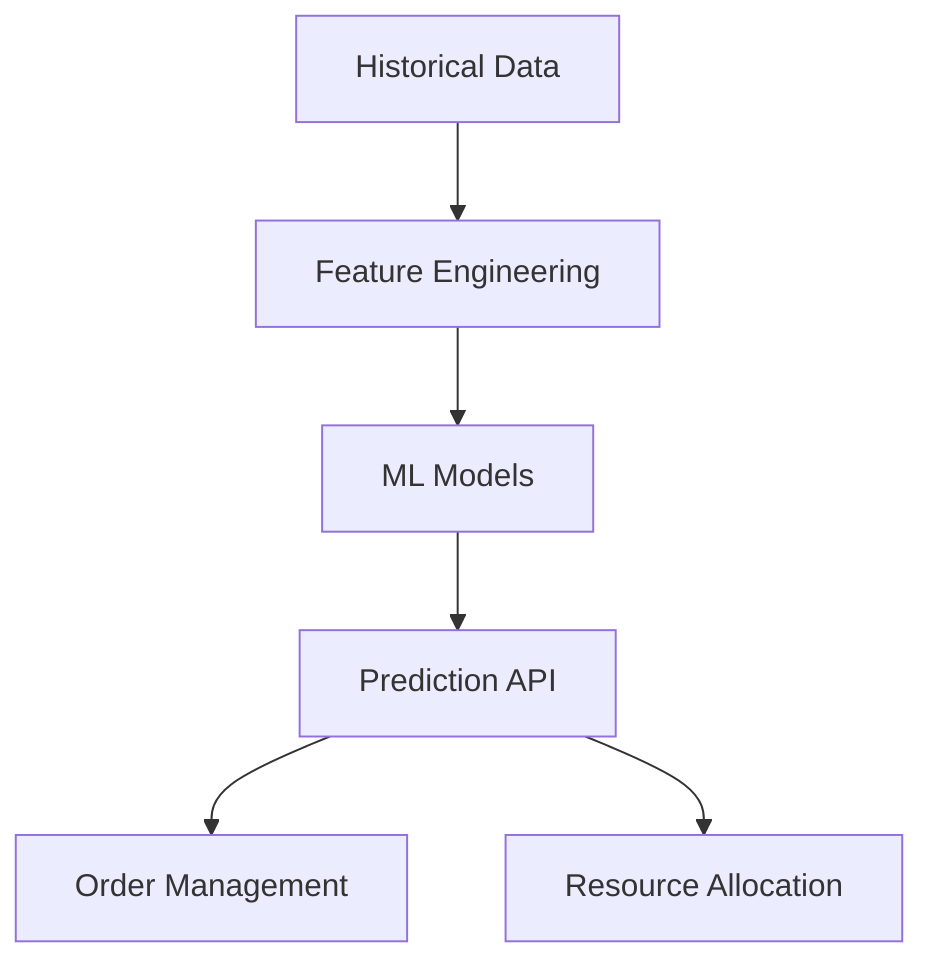

# AI & Automation System Technical Documentation

## System Overview
AI-powered system for order prediction, resource optimization, and automated decision-making across the platform.

## Architecture Components

### 1. Prediction Engine


### Key ML Models
- Order Volume Predictor
- Delivery Time Estimator
- Resource Demand Predictor
- Customer Behavior Analyzer

### Technical Stack
- TensorFlow/PyTorch for ML models
- scikit-learn for data processing
- FastAPI for model serving
- Redis for model caching
- PostgreSQL for data storage

## Core Features

### 1. Order Prediction
```python
class OrderPrediction:
    timestamp: datetime
    location: Location
    predicted_volume: int
    confidence_score: float
    factors: List[PredictionFactor]
```

#### Components
- Time-series Analysis
- Seasonal Adjustment
- Geographic Clustering
- Weather Impact Analysis

### 2. Resource Optimization
- Driver Assignment Algorithm
- Route Optimization
- Inventory Management
- Kitchen Capacity Planning

### 3. Automated Decision Making
- Order Acceptance Logic
- Pricing Optimization
- Delivery Zone Management
- Merchant Capacity Management

## Data Pipeline

### Data Sources
- Order History
- Customer Behavior
- Traffic Patterns
- Weather Data
- Special Events
- Social Media Trends

### Processing Layers
1. Data Collection
2. Preprocessing
3. Feature Engineering
4. Model Training
5. Inference
6. Feedback Loop

## API Endpoints

### Prediction APIs
```
POST /api/v1/ai/predict/orders
POST /api/v1/ai/predict/delivery-time
POST /api/v1/ai/optimize/routes
POST /api/v1/ai/analyze/demand
```

### Model Management
```
POST /api/v1/ai/models/train
GET /api/v1/ai/models/status
PUT /api/v1/ai/models/deploy
```

## Performance Requirements

### Response Times
- Real-time Predictions: < 100ms
- Batch Predictions: < 5s
- Model Training: < 1 hour
- Route Optimization: < 30s

### Accuracy Metrics
- Order Volume Prediction: ±10%
- Delivery Time Estimation: ±5 minutes
- Resource Allocation: 95% efficiency
- Customer Behavior: 85% accuracy

## Monitoring & Alerts

### Model Monitoring
- Prediction Accuracy
- Model Drift
- Feature Importance
- Resource Usage

### System Monitoring
- API Latency
- Error Rates
- Resource Utilization
- Training Pipeline Status

## Security Measures
- Model Access Control
- Data Encryption
- API Authentication
- Rate Limiting
- Audit Logging

## Deployment Strategy
- Model Versioning
- A/B Testing
- Canary Deployments
- Rollback Procedures

## Integration Points
- Order Processing System
- Delivery Management
- Inventory System
- Customer Service
- Analytics Dashboard

## Error Handling
- Model Fallbacks
- Data Quality Issues
- System Overload
- Integration Failures

## Future Enhancements
- Real-time Model Updates
- Multi-model Ensemble
- Advanced NLP Features
- Computer Vision Integration 