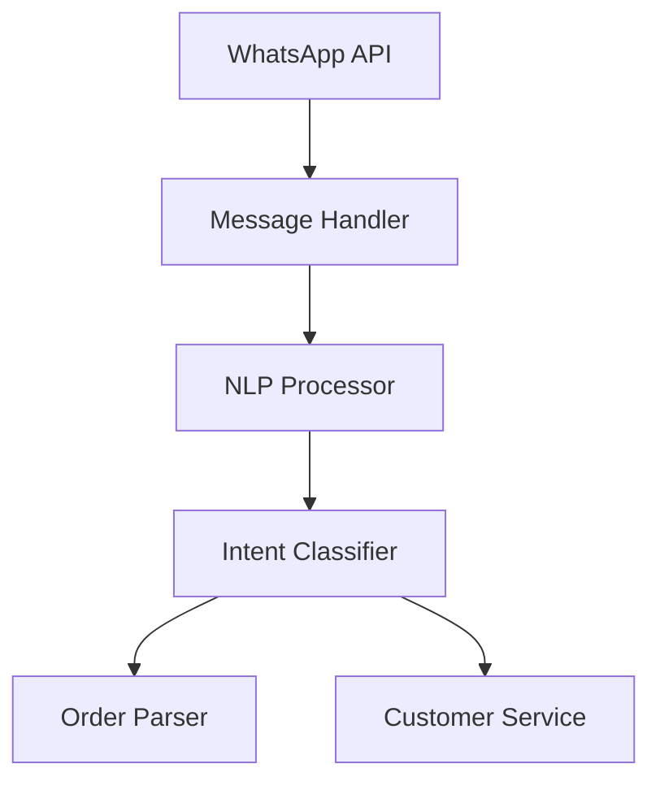

# Customer Interaction Channels Technical Documentation

## System Overview
Multi-channel customer interaction system handling orders and communications through WhatsApp, Instagram, and web interfaces.

## WhatsApp Integration

### Architecture

### Components
- Twilio WhatsApp Business API
- Message Queue System
- Natural Language Processing
- Order Processing Pipeline

### Features
- Automated Order Taking
- Status Updates
- Customer Support
- Payment Processing

## Instagram Integration

### Architecture
- Instagram Graph API
- Direct Message Handler
- Media Content Manager
- Story/Post Order Processing

### Features
- Story Order Processing
- Direct Message Orders
- Media-based Menu Display
- Social Engagement Tracking

## Voice/Text Processor

### NLP Components
- Intent Recognition
- Entity Extraction
- Language Detection
- Sentiment Analysis

### Supported Languages
- English (Primary)
- Spanish
- Arabic
- Chinese

## Technical Requirements

### API Rate Limits
- WhatsApp: 80 messages/second
- Instagram: 200 calls/hour
- Website: 1000 requests/minute

### Response Times
- Message Processing: < 1s
- Order Confirmation: < 2s
- Status Updates: < 5s

### Data Storage
- Message History: 90 days
- Order History: Indefinite
- Media Files: 30 days

## Error Handling
- Network Failures
- API Limits
- Message Processing Errors
- Order Validation Errors

## Security Measures
- End-to-End Encryption
- Message Validation
- Access Control
- Rate Limiting

## Monitoring
- Message Volume
- Response Times
- Error Rates
- Customer Satisfaction

## Integration Testing
- API Endpoint Tests
- Message Processing Tests
- Order Flow Tests
- Error Recovery Tests 