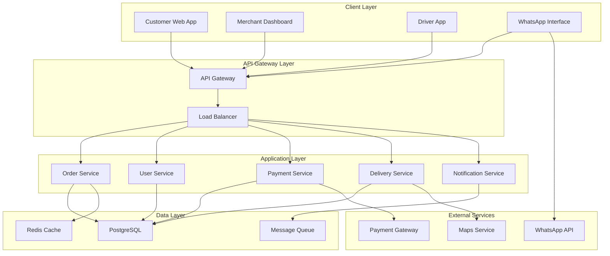

# Deployment Architecture Documentation

## System Architecture Overview



## Infrastructure Components

### Cloud Services (AWS)
- EC2 for application servers
- RDS for PostgreSQL
- ElastiCache for Redis
- SQS for message queuing
- S3 for file storage
- CloudFront for CDN
- Route 53 for DNS

### Kubernetes Cluster
```yaml
# High-level cluster configuration
apiVersion: v1
kind: Cluster
metadata:
  name: mealkitz-cluster
spec:
  nodes: 3
  region: us-east-1
  version: 1.24
```

### Service Mesh (Istio)
- Traffic management
- Security policies
- Observability
- Service discovery

## Deployment Configuration

### Docker Containers
```dockerfile
# Base application image
FROM python:3.9-slim
WORKDIR /app
COPY requirements.txt .
RUN pip install -r requirements.txt
COPY . .
CMD ["uvicorn", "main:app", "--host", "0.0.0.0"]
```

### Kubernetes Deployments
```yaml
apiVersion: apps/v1
kind: Deployment
metadata:
  name: order-service
spec:
  replicas: 3
  selector:
    matchLabels:
      app: order-service
  template:
    metadata:
      labels:
        app: order-service
    spec:
      containers:
      - name: order-service
        image: mealkitz/order-service:latest
        ports:
        - containerPort: 8000
```

## Scaling Strategy

### Horizontal Pod Autoscaling
```yaml
apiVersion: autoscaling/v2
kind: HorizontalPodAutoscaler
metadata:
  name: order-service-hpa
spec:
  scaleTargetRef:
    apiVersion: apps/v1
    kind: Deployment
    name: order-service
  minReplicas: 3
  maxReplicas: 10
  metrics:
  - type: Resource
    resource:
      name: cpu
      target:
        type: Utilization
        averageUtilization: 70
```

### Database Scaling
- Read replicas
- Connection pooling
- Query optimization
- Sharding strategy

## Security Configuration

### Network Security
- VPC configuration
- Security groups
- Network policies
- SSL/TLS termination

### Authentication
- JWT tokens
- OAuth2 integration
- API key management
- Role-based access

## Monitoring & Logging

### Prometheus Configuration
```yaml
apiVersion: monitoring.coreos.com/v1
kind: ServiceMonitor
metadata:
  name: api-monitor
spec:
  selector:
    matchLabels:
      app: api-gateway
  endpoints:
  - port: http
```

### Logging Pipeline
- ELK Stack
- Log aggregation
- Log retention
- Alert configuration

## Backup & Recovery

### Database Backups
- Automated daily backups
- Point-in-time recovery
- Cross-region replication
- Backup verification

### Disaster Recovery
- Multi-region deployment
- Failover procedures
- Data synchronization
- Recovery testing

## CI/CD Pipeline

### GitHub Actions Workflow
```yaml
name: Deploy to Production
on:
  push:
    branches: [main]
jobs:
  deploy:
    runs-on: ubuntu-latest
    steps:
      - uses: actions/checkout@v2
      - name: Build and Test
        run: |
          docker build -t app .
          docker run app pytest
      - name: Deploy to K8s
        run: |
          kubectl apply -f k8s/
```

## Environment Configuration

### Production Environment
```yaml
environment:
  DATABASE_URL: ${SUPABASE_URL}
  REDIS_URL: ${REDIS_URL}
  AWS_REGION: us-east-1
  LOG_LEVEL: info
  ENABLE_METRICS: true
```

## Performance Optimization

### CDN Configuration
- Static asset caching
- Edge locations
- Cache invalidation
- Performance monitoring

### API Gateway Configuration
- Rate limiting
- Request throttling
- Circuit breakers
- Timeout policies

## Rollout Strategy

### Deployment Procedures
1. Canary deployments
2. Blue-green deployments
3. Feature flags
4. Rollback procedures

### Health Checks
```yaml
livenessProbe:
  httpGet:
    path: /health
    port: 8000
  initialDelaySeconds: 30
  periodSeconds: 10
readinessProbe:
  httpGet:
    path: /ready
    port: 8000
  initialDelaySeconds: 5
  periodSeconds: 5
``` 