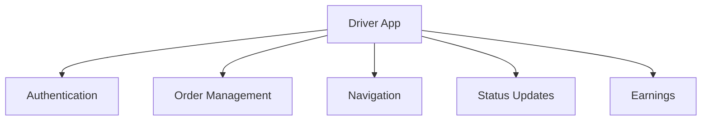

# Driver App Technical Documentation

## System Overview
Mobile application for delivery drivers to manage orders, optimize routes, and handle deliveries efficiently.

## Architecture Components

### 1. Mobile App Architecture


### Technical Stack
- React Native for mobile app
- Node.js backend services
- Google Maps Platform
- WebSocket for real-time updates
- Push Notifications

## Core Features

### 1. Order Management
```typescript
interface DeliveryOrder {
    orderId: string;
    pickupLocation: Location;
    dropoffLocation: Location;
    customerDetails: CustomerInfo;
    timeWindows: TimeConstraints;
    status: OrderStatus;
    specialInstructions: string;
}
```

#### Components
- Order Queue
- Order Details
- Status Updates
- Delivery Confirmation

### 2. Navigation System
- Real-time GPS Tracking
- Route Optimization
- Turn-by-turn Navigation
- Traffic Updates
- Geofencing

### 3. Driver Features
- Earnings Dashboard
- Schedule Management
- Performance Metrics
- Support Chat
- Document Management

## API Endpoints

### Order Management
```
GET /api/v1/driver/orders
PUT /api/v1/driver/orders/{order_id}/status
POST /api/v1/driver/orders/{order_id}/location
GET /api/v1/driver/earnings
```

### Navigation
```
POST /api/v1/driver/routes/optimize
GET /api/v1/driver/zones
POST /api/v1/driver/location/update
```

## Real-time Features

### WebSocket Events
- Order Assignment
- Status Updates
- Location Updates
- Customer Messages
- System Alerts

### Push Notifications
- New Order Alerts
- Schedule Reminders
- Earnings Updates
- System Messages

## Offline Capabilities
- Order Data Caching
- Map Data Storage
- Queue Management
- Status Updates Queue
- Automatic Sync

## Performance Requirements

### Response Times
- App Launch: < 2s
- Order Loading: < 1s
- Map Updates: < 500ms
- Location Updates: Every 10s
- Navigation: Real-time

### Battery Optimization
- GPS Polling Intervals
- Background Processing
- Data Sync Strategy
- Push Notification Management

## Security Measures
- Driver Authentication
- Location Data Encryption
- Secure Storage
- Session Management
- Device Verification

## Error Handling
- Network Issues
- GPS Signal Loss
- Order Conflicts
- Payment Problems
- App Crashes

## Monitoring
- Driver Activity
- Order Completion Rate
- Navigation Accuracy
- App Performance
- Battery Usage

## Integration Points
- Order Management System
- Customer App
- Payment System
- Support System
- Analytics Platform

## Testing Requirements
- Unit Tests
- Integration Tests
- Performance Tests
- Offline Testing
- Location Simulation

## Deployment Strategy
- App Store Release
- Beta Testing
- Version Management
- Rollback Process
- Feature Flags

## Documentation
- API Documentation
- User Guide
- Troubleshooting Guide
- Release Notes
- Support Documentation 