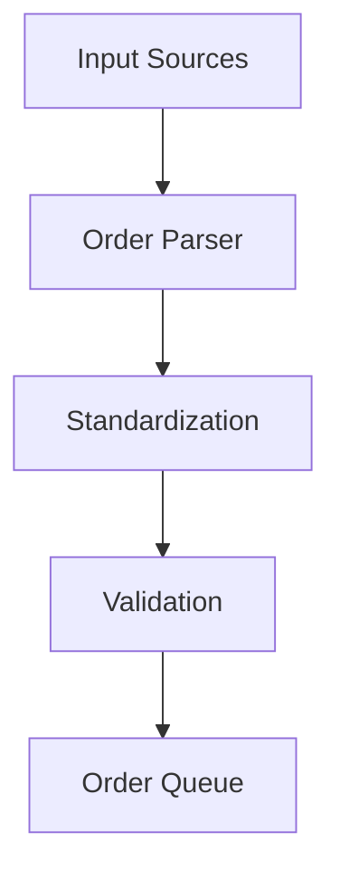

# Order Processing System Technical Documentation

## System Overview
The order processing system is the core component that handles orders from multiple input channels and manages their lifecycle through fulfillment.

## Architecture Components

### 1. Order Parser


#### Key Components
- Input Adapters (WhatsApp, Instagram, Website)
- NLP Processing Layer
- Validation Engine
- Queue Manager

#### Technical Stack
- FastAPI for API endpoints
- RabbitMQ for message queuing
- PostgreSQL for order storage
- Redis for caching

### 2. Order Builder

#### Components
- Price Calculator
- Inventory Checker
- Special Instructions Handler
- Order Optimizer

#### Data Models
```python
class Order:
    id: str
    customer_id: str
    items: List[OrderItem]
    special_instructions: str
    status: OrderStatus
    created_at: datetime
    updated_at: datetime
```

### 3. Integration Points
- Merchant System
- Payment Gateway
- Delivery System
- Notification System

## API Endpoints

### Order Creation
```
POST /api/v1/orders
GET /api/v1/orders/{order_id}
PUT /api/v1/orders/{order_id}/status
```

## Error Handling
- Input Validation Errors
- Processing Errors
- Integration Errors
- System Errors

## Performance Requirements
- Order Processing Time: < 2s
- Concurrent Orders: 1000/minute
- Data Consistency: 99.99%
- System Uptime: 99.9%

## Monitoring
- Order Processing Metrics
- Queue Length
- Processing Time
- Error Rates

## Security
- Input Sanitization
- Authentication
- Rate Limiting
- Data Encryption 