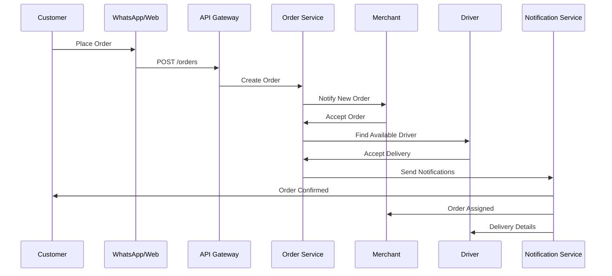
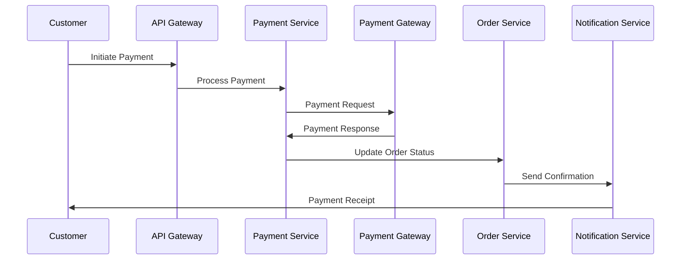
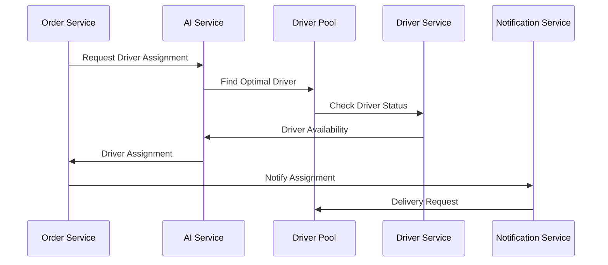
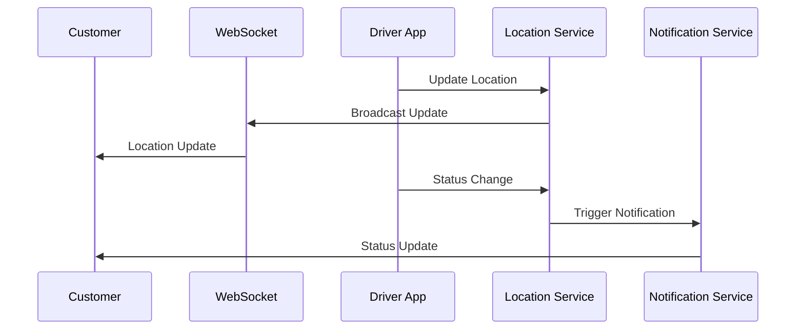
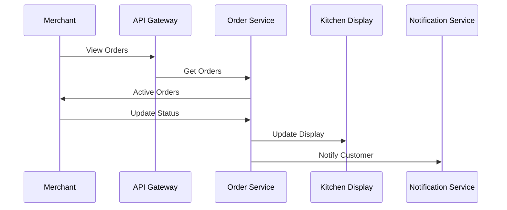
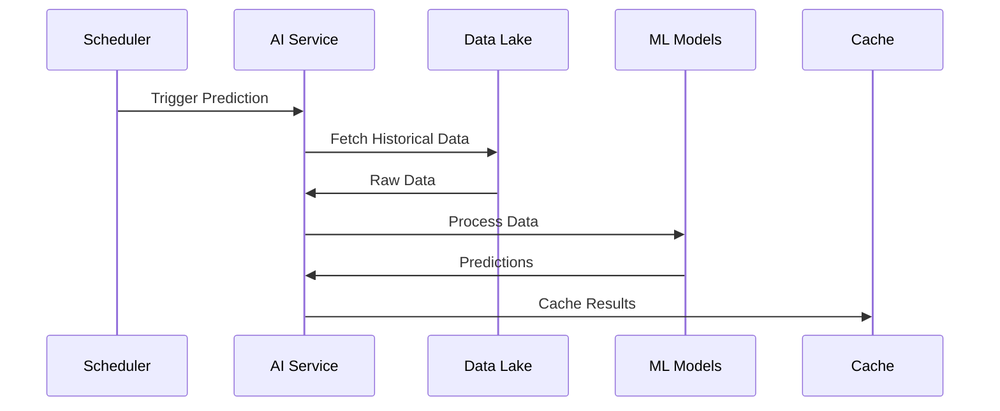
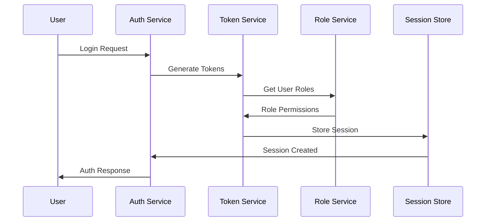
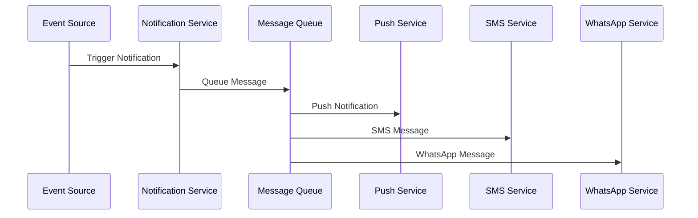
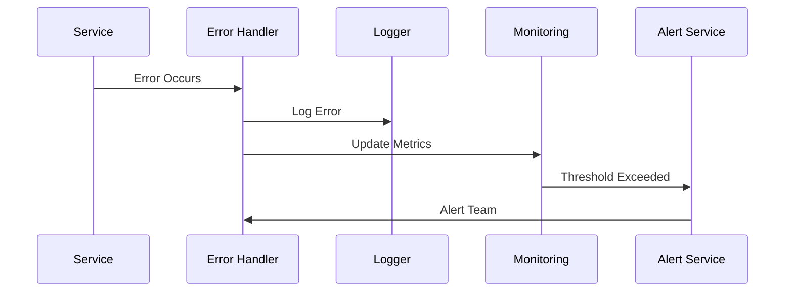
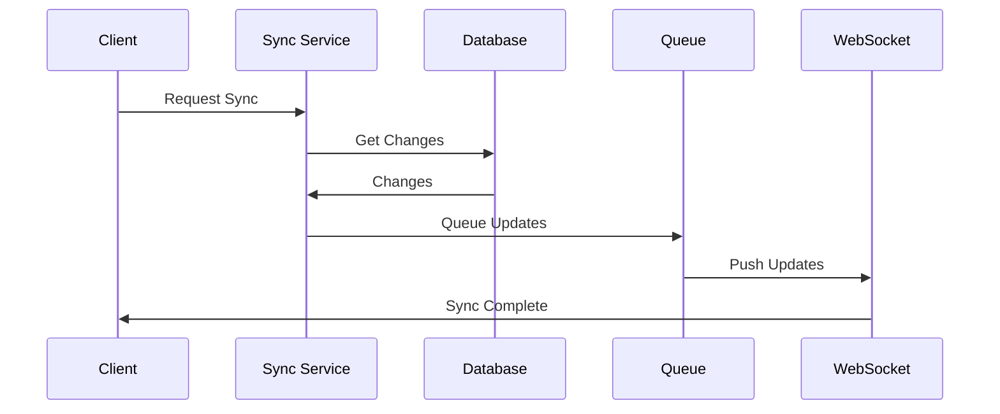

# Sequence Diagrams

## Order Processing Flow

## Payment Processing Flow

## Driver Assignment Flow

## Real-time Order Tracking

## Merchant Order Management

## AI Prediction Flow

## Authentication Flow

## Notification Flow

## Error Handling Flow

## Data Sync Flow

